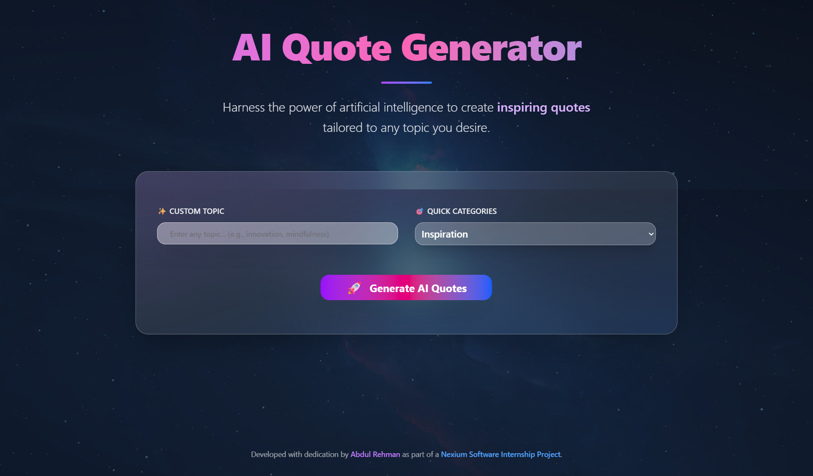
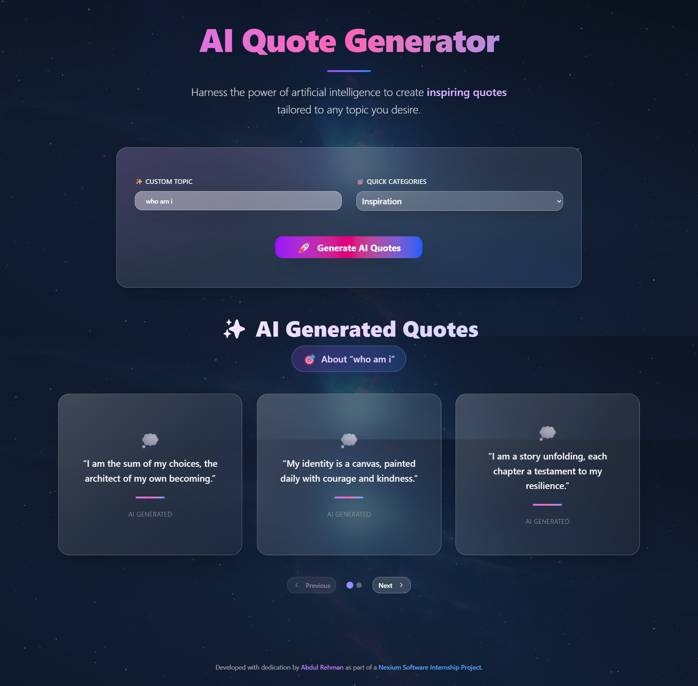

# 🎯 AI-Powered Quote Generator 

[](https://nextjs.org/)
[](https://www.typescriptlang.org/)
[](https://tailwindcss.com/)
[](https://ai.google.dev/)

A modern, AI-powered quote generator that creates personalized inspirational quotes using Google's Gemini AI. Built with Next.js 15, featuring a beautiful glassmorphism UI, smooth animations, and responsive design.

## 🌟 Features

### Core Functionality
- **🤖 AI-Powered Generation**: Leverages Google Gemini AI for unique, contextual quotes
- **🎨 Custom Topics**: Generate quotes about any topic you can imagine
- **📚 Predefined Categories**: 15+ curated categories for quick inspiration
- **⚡ Real-time Generation**: Instant quote creation with loading states
- **🔄 Multiple Quotes**: Generate multiple quotes per topic

### User Experience
- **🎭 Glassmorphism Design**: Modern, elegant UI with glass-like effects
- **📱 Fully Responsive**: Optimized for desktop, tablet, and mobile devices
- **🎬 Smooth Animations**: Framer Motion powered transitions and effects
- **♿ Accessibility**: WCAG compliant with proper contrast and keyboard navigation
- **⚠️ Error Handling**: Graceful error states with helpful messages

### Technical Excellence
- **🚀 Next.js 15**: Latest App Router with server components
- **📘 TypeScript**: Full type safety and IntelliSense support
- **🎨 ShadCN UI**: Beautiful, accessible component library
- **🌊 Tailwind CSS**: Utility-first styling with custom design system
- **🔧 Modern Tooling**: ESLint, Prettier, and optimized build pipeline

## 📸 Screenshots

| **Input Interface** | **Generated Output** |
|---------------------|----------------------|
|  |  |

*Experience the beautiful glassmorphism UI and see AI-generated quotes in action*

## 🚀 Quick Start

### Prerequisites
- Node.js 18.17 or later
- npm, yarn, or pnpm
- Google AI Studio account for API key

### Installation

1. **Clone the repository**
   ```bash
   git clone https://github.com/abdulrehman-dev-ai/Nexium_Abdul_Rehman_AI-Web-Dev-Quote-Generator.git
   cd Nexium_Abdul_Rehman_AI-Web-Dev-Quote-Generator
   ```

2. **Install dependencies**
   ```bash
   npm install
   # or
   yarn install
   # or
   pnpm install
   ```

3. **Set up environment variables**
   ```bash
   # Create .env.local file
   cp .env.example .env.local
   ```
   
   Add your Gemini API key to `.env.local`:
   ```env
   GEMINI_API_KEY=your_gemini_api_key_here
   ```

4. **Run the development server**
   ```bash
   npm run dev
   # or
   yarn dev
   # or
   pnpm dev
   ```

5. **Open your browser**
   Navigate to [http://localhost:3000/assignment-1](http://localhost:3000/assignment-1)

## 🔑 Getting Your Gemini API Key

1. Visit [Google AI Studio](https://makersuite.google.com/app/apikey)
2. Sign in with your Google account
3. Click "Create API Key" or "Get API Key"
4. Copy the generated API key
5. Add it to your `.env.local` file

> ⚠️ **Security Note**: Never commit your API key to version control. The `.env.local` file is already included in `.gitignore`.

## 📖 Usage Guide

### Generating Quotes

1. **Custom Topic Method**:
   - Enter any topic in the input field (e.g., "artificial intelligence", "ocean conservation")
   - Click "Generate AI Quotes"
   - Watch as unique quotes appear with smooth animations

2. **Category Selection**:
   - Choose from predefined categories:
     - 💡 **Inspiration** - Motivational and uplifting quotes
     - 🎯 **Success** - Achievement and goal-oriented wisdom
     - 🧠 **Wisdom** - Philosophical and thoughtful insights
     - ❤️ **Love** - Relationships and emotional connections
     - 🎨 **Creativity** - Innovation and artistic expression
     - 👑 **Leadership** - Management and influence guidance
     - 💪 **Perseverance** - Resilience and determination
     - 🧘 **Mindfulness** - Peace and self-awareness
     - And many more...

### Tips for Best Results
- Be specific with your topics for more targeted quotes
- Try combining concepts (e.g., "technology and humanity")
- Experiment with different categories to discover new perspectives
- Use the app regularly for daily inspiration

## 🏗️ Project Architecture

```
src/
├── app/
│   ├── api/                    # API routes (if any)
│   ├── assignment-1/           # Main application page
│   │   └── page.tsx            # Quote generator interface
│   ├── globals.css             # Global styles and Tailwind imports
│   ├── layout.tsx              # Root layout component
│   └── page.tsx                # Home page
├── components/
│   └── ui/                     # Reusable UI components
│       ├── button.tsx          # Custom button component
│       ├── card.tsx            # Card component for quotes
│       └── input.tsx           # Input field component
├── lib/
│   └── utils.ts                # Utility functions and helpers
└── middleware.ts               # Next.js middleware (if needed)
```

## 🛠️ Tech Stack

### Frontend
- **[Next.js 15](https://nextjs.org/)** - React framework with App Router
- **[TypeScript](https://www.typescriptlang.org/)** - Type-safe JavaScript superset
- **[Tailwind CSS](https://tailwindcss.com/)** - Utility-first CSS framework
- **[ShadCN UI](https://ui.shadcn.com/)** - Beautiful and accessible component library
- **[Framer Motion](https://www.framer.com/motion/)** - Production-ready motion library

### AI & APIs
- **[Google Generative AI](https://ai.google.dev/)** - Gemini AI for quote generation

### Development Tools
- **[ESLint](https://eslint.org/)** - Code linting and quality
- **[Prettier](https://prettier.io/)** - Code formatting
- **[PostCSS](https://postcss.org/)** - CSS processing

## 🎨 Design System

### Color Palette
- **Primary**: Modern gradient backgrounds
- **Glass Effects**: Semi-transparent overlays with backdrop blur
- **Text**: High contrast for accessibility
- **Accents**: Subtle hover and focus states

### Typography
- **Headings**: Clean, modern font stack
- **Body**: Optimized for readability
- **Code**: Monospace for technical content

### Components
- **Glassmorphism Cards**: Elegant quote display containers
- **Animated Buttons**: Smooth hover and click interactions
- **Responsive Grid**: Adaptive layout for all screen sizes

## 🚀 Deployment

### Vercel (Recommended)
1. Push your code to GitHub
2. Connect your repository to [Vercel](https://vercel.com)
3. Add your `GEMINI_API_KEY` to environment variables
4. Deploy automatically

### Other Platforms
- **Netlify**: Add build command `npm run build` and publish directory `out`
- **Railway**: Configure environment variables and deploy
- **Docker**: Use the included Dockerfile for containerized deployment

## 🤝 Contributing

Contributions are welcome! Please feel free to submit a Pull Request. For major changes, please open an issue first to discuss what you would like to change.

### Development Workflow
1. Fork the repository
2. Create a feature branch (`git checkout -b feature/amazing-feature`)
3. Commit your changes (`git commit -m 'Add some amazing feature'`)
4. Push to the branch (`git push origin feature/amazing-feature`)
5. Open a Pull Request

## 📝 License

This project is licensed under the MIT License - see the [LICENSE](LICENSE) file for details.

## 👨‍💻 Author

**Abdul Rehman**
- 🎓 Nexium AI Web Development Intern, Summer 2025
- 📧 Email: iamabdulrehman.technophile@gmail.com
- 🐙 GitHub: [@abdulrehman-dev-ai](https://github.com/abdulrehman-dev-ai)
- 💼 LinkedIn: [Connect with me](https://www.linkedin.com/in/abdulrehmansarwar)

## 🙏 Acknowledgments

- **Nexium AI** for the internship opportunity
- **Google AI** for the powerful Gemini API
- **Vercel** for seamless deployment
- **ShadCN** for the beautiful component library
- **The open-source community** for the amazing tools and libraries

---

<div align="center">
  <p>Made with ❤️ by Abdul Rehman</p>
  <p>Part of Nexium AI Web Development Internship 2025</p>
</div>
